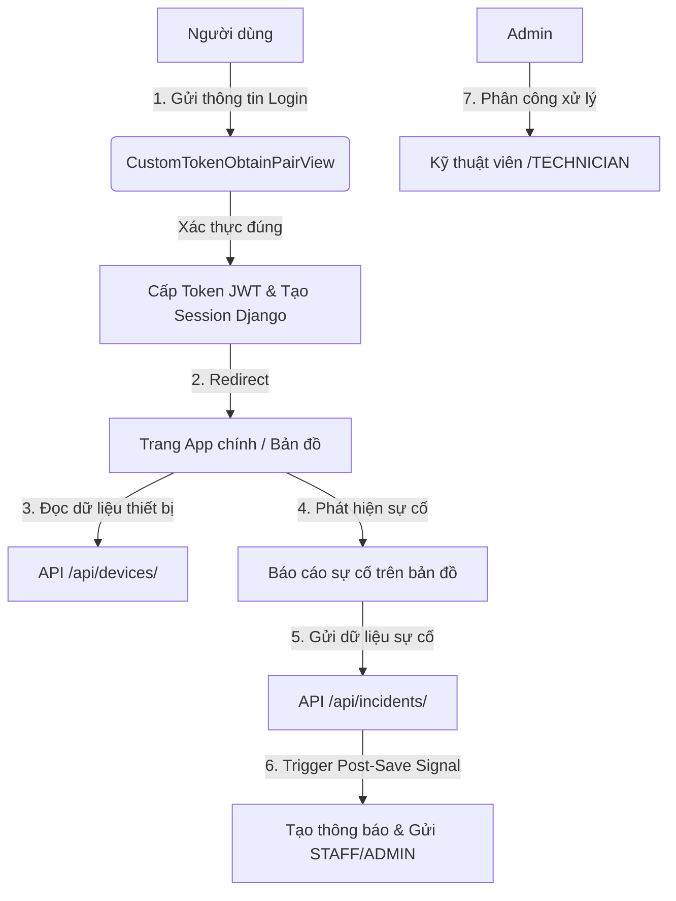

# 🗺️ Bản Đồ Chi Tiết Dự Án: Hệ thống quản lý hạ tầng điện – nước đô thị dựa trên bản đồ

Tài liệu này được tạo ra để cung cấp một cái nhìn toàn diện, cấu trúc thư mục, kiến trúc phần mềm, cơ sở dữ liệu và các luồng nghiệp vụ cốt lõi trong dự án của bạn. Nó sẽ giúp bạn dễ dàng tra cứu, định vị các cấu phần mã nguồn và tìm hướng giải quyết các bài toán kỹ thuật/sản phẩm.

---

## 1. Tổng Quan & Kiến Trúc Dự Án

Dự án được xây dựng dưới dạng một ứng dụng **Django Monolith** tích hợp mạnh mẽ giữa:
- **Backend**: Cung cấp API chuẩn REST (sử dụng **Django REST Framework**) và quản trị dữ liệu tập trung thông qua cơ sở dữ liệu SQLite (với cấu trúc chuẩn bị sẵn sàng mở rộng PostgreSQL/PostGIS).
- **Authentication**: Xác thực bằng **JSON Web Token (SimpleJWT)** và duy trì Django Session song song để bảo vệ cả API endpoints lẫn các trang giao diện (Templates).
- **Frontend**: Kết hợp giữa các trang HTML giao diện (**Django Templates** + **Bootstrap 5**) và các bộ điều khiển logic JavaScript thuần (**Vanilla JavaScript**). 
- **Bản đồ**: Sử dụng thư viện mã nguồn mở **Leaflet.js** hiển thị trên nền bản đồ **OpenStreetMap** để trực quan hóa toàn bộ tọa độ thiết bị hạ tầng (điện/nước) và các điểm sự cố.

---

## 2. Bản Đồ Thư Mục Dự Án (Project Directory Tree)

Dưới đây là cấu trúc chi tiết của toàn bộ mã nguồn dự án:

```yaml
PM-Group-2/
│
├── core/                           # Thư mục cấu hình cốt lõi của Django Project
│   ├── settings.py                 # Cấu hình hệ thống (Apps, Middleware, DB, JWT, Throttling, Logs)
│   ├── urls.py                     # Định tuyến toàn bộ hệ thống (trang templates và api endpoints)
│   ├── views.py                    # API kiểm tra trạng thái sức khỏe (health check) và session auth
│   ├── exception_handler.py        # Bộ xử lý ngoại lệ tùy chỉnh cho các lỗi API toàn cục
│   └── wsgi.py / asgi.py           # Cấu hình máy chủ WSGI/ASGI
│
├── accounts/                       # Django App: Quản lý người dùng & phân quyền (RBAC)
│   ├── models.py                   # Custom User model (vai trò ADMIN, OPERATOR, TECHNICIAN, CITIZEN) và AuditLog
│   ├── views.py                    # Viewsets xử lý Login (JWT+Session), Logout, Đổi mật khẩu, CRUD Người dùng
│   ├── serializers.py              # Bộ tuần tự hóa dữ liệu User, Login, AuditLog
│   ├── urls.py                     # Định tuyến API liên quan đến tài khoản
│   ├── middleware.py               # AuditLogMiddleware ghi nhận các hành động thay đổi dữ liệu (POST, PUT,...)
│   ├── permissions.py              # Lớp phân quyền IsAdminRole bảo vệ các API quản trị
│   └── signals.py                  # Tự động khóa tài khoản sau 5 lần đăng nhập sai, reset khi đăng nhập thành công
│
├── assets/                         # Django App: Quản lý thiết bị hạ tầng và mạng lưới điện – nước
│   ├── models.py                   # Các lớp dữ liệu: Device (Thiết bị), NetworkEdge (Tuyến nối), ConsumptionLog (Tiêu thụ)
│   ├── views.py                    # Viewsets xử lý danh sách thiết bị, nhập/xuất file CSV hạ tầng, tiêu thụ
│   ├── serializers.py              # Bộ tuần tự hóa dữ liệu Device và ConsumptionLog
│   ├── urls.py                     # Định tuyến các API thiết bị hạ tầng
│   └── tests.py                    # Toàn bộ mã nguồn các bài kiểm thử tự động (Unit Test / Smoke Test)
│
├── incidents/                      # Django App: Quản lý sự cố & phân công bảo trì
│   ├── models.py                   # Các lớp dữ liệu: Incident (Sự cố), IncidentNote (Ghi chú xử lý), Notification (Thông báo)
│   ├── views.py                    # Viewsets xử lý báo cáo sự cố, phân công kỹ thuật, thống kê hiệu suất & phân tích
│   ├── serializers.py              # Bộ tuần tự hóa dữ liệu Incident, IncidentNote, Notification
│   ├── urls.py                     # Định tuyến các API sự cố & thông báo
│   └── signals.py                  # Tự động gửi thông báo qua hệ thống khi sự cố được tạo/phân công/xử lý
│
├── templates/                      # Chứa các giao diện trang web (Django Templates)
│   ├── base.html                   # Cấu trúc khung giao diện chung (Bootstrap 5, Inter Font, Icons)
│   ├── login.html                  # Trang Đăng nhập
│   ├── app.html                    # Bản đồ tương tác hạ tầng & quản lý thiết bị trực quan
│   ├── monitoring.html             # Trang nhập và theo dõi chỉ số tiêu thụ điện - nước
│   ├── users.html                  # Giao diện quản lý tài khoản người dùng hệ thống (chỉ dành cho ADMIN)
│   ├── incidents.html              # Trang báo cáo, danh sách và giao diện xử lý sự cố
│   ├── report.html                 # Giao diện truy vấn báo cáo và thống kê sự cố chi tiết
│   ├── dashboard.html              # Bảng số liệu thống kê (KPIs, Biểu đồ xu hướng sự cố)
│   ├── notifications.html          # Hộp thư thông báo trong ứng dụng của người dùng
│   └── analytics.html              # Trang phân tích chuyên sâu dữ liệu
│
├── static/                         # Thư mục lưu trữ tài nguyên tĩnh (CSS, JS)
│   ├── css/
│   │   └── app.css                 # File tùy biến giao diện CSS (giao diện dashboard hiện đại, màu sắc trực quan)
│   └── js/                         # Logic điều khiển JavaScript cho từng trang tương ứng
│       ├── login.js                # Xử lý đăng nhập bằng JWT và quản lý Token lưu ở localStorage
│       ├── app.js                  # Khởi tạo bản đồ Leaflet, hiển thị thiết bị, vẽ mạng lưới tuyến đường và tương tác
│       ├── monitoring.js           # Xử lý API tiêu thụ, vẽ biểu đồ tiêu thụ cho thiết bị
│       ├── users.js                # Logic CRUD người dùng và kiểm tra tính hợp lệ dữ liệu nhập
│       ├── incidents.js            # Logic báo cáo sự cố tại vị trí bản đồ, bình luận ghi chú, cập nhật trạng thái
│       ├── report.js               # Lọc dữ liệu báo cáo sự cố nâng cao và chuẩn bị dữ liệu xuất
│       ├── dashboard.js            # Gọi thống kê KPI hệ thống, vẽ biểu đồ xu hướng 7 ngày (sử dụng Chart.js)
│       ├── notifications.js        # Đọc danh sách thông báo, đánh dấu đã đọc hoặc đọc tất cả
│       └── analytics.js            # Phân tích dữ liệu chuyên sâu nâng cao
│
├── db.sqlite3                      # Cơ sở dữ liệu SQLite cục bộ (lưu trữ sẵn dữ liệu test và cấu trúc bảng)
├── requirements.txt                # Danh sách các thư viện Python cài đặt (Django, DRF, DRF-SimpleJWT, Gunicorn, PyMySQL)
├── Dockerfile                      # File cấu hình đóng gói Docker chạy tự động migrate + test + gunicorn
├── .dockerignore                   # Danh sách file loại trừ khỏi Docker image
├── manage.py                       # CLI quản trị dự án Django quen thuộc
├── Jira_SprintPlan_4x1Week.md      # Kế hoạch chi tiết phân rã công việc Jira theo 4 sprint (4 tuần)
└── bachlog.txt                     # File chứa toàn bộ User Stories và mô tả yêu cầu tính năng từ góc nhìn người dùng
```

---

## 3. Thiết Kế Cơ Sở Dữ Liệu (Data Models & Schemas)

Hệ thống cơ sở dữ liệu được tổ chức chặt chẽ thành 3 nhóm tương ứng với các Django App:

### 3.1 🔐 Module accounts (Quản lý User & Nhật Ký Hoạt Động)
* **`User` (Kế thừa từ `AbstractUser`)**:
  * `role`: Vai trò người dùng sử dụng RBAC (`ADMIN` - Quản trị viên, `OPERATOR` - Nhân viên vận hành, `TECHNICIAN` - Kỹ thuật viên, `CITIZEN` - Người dân).
  * `failed_login_attempts`: Theo dõi số lần đăng nhập lỗi để khóa tài khoản khi cần.
  * Tích hợp cơ chế tự động đồng bộ tài khoản Superuser làm vai trò `ADMIN`.
* **`AuditLog`**:
  * Tự động ghi lại các hành động sửa đổi dữ liệu (`POST`, `PUT`, `PATCH`, `DELETE`) từ người dùng.
  * Lưu trữ `user`, `action` (phương thức HTTP), `path` (đường dẫn API), `ip_address`, `timestamp` và `details` dạng JSON.

### 3.2 🔌 Module assets (Quản lý Thiết Bị & Bản Đồ Mạng Lưới)
* **`Device`**:
  * `code`: Mã duy nhất cho thiết bị (Tự động sinh từ tên nếu để trống).
  * `name`: Tên thiết bị.
  * `device_type`: Loại thiết bị phân định rạch ròi thành:
    * *Hạ tầng điện*: `TRANSFORMER` (Trạm biến áp), `DISTRIBUTION_BOX` (Tủ điện), `ELECTRIC_POLE` (Trụ điện), `ELECTRIC_JUNCTION` (Điểm nối điện), `ELECTRIC_METER` (Công tơ điện).
    * *Hạ tầng nước*: `WATER_TANK` (Bể nước), `PUMP_STATION` (Trạm bơm), `MAIN_VALVE` (Van tổng), `BRANCH_VALVE` (Van nhánh), `WATER_JUNCTION` (Điểm nối nước), `WATER_METER` (Đồng hồ nước).
  * `latitude` / `longitude`: Tọa độ vị trí địa lý của thiết bị trên bản đồ.
  * `status`: Trạng thái mạng lưới (`ACTIVE` - Hoạt động, `FAULT` - Lỗi trực tiếp, `AFFECTED` - Bị ảnh hưởng, `MAINTENANCE` - Bảo trì, `INACTIVE` - Ngưng hoạt động).
  * `attributes`: Trường JSON chứa thuộc tính mở rộng cho từng loại thiết bị.
  * `address` / `area`: Thông tin địa chỉ và phân vùng khu vực.
* **`NetworkEdge` (Tuyến truyền dẫn kết nối thiết bị)**:
  * Kết nối nguồn từ `from_device` sang `to_device` (Mối quan hệ 1-nhiều hoặc cây thứ bậc).
  * Định nghĩa `network_type` (`ELECTRIC` hoặc `WATER`) để tô màu tuyến cáp/đường ống khác nhau trên bản đồ.
  * Ràng buộc duy nhất: Không cho phép có 2 tuyến trùng hướng giữa cùng một cặp thiết bị.
* **`NetworkStatusHistory`**:
  * Ghi nhận lịch sử thay đổi trạng thái của Thiết bị (`Device`) hoặc Tuyến nối (`NetworkEdge`) phục vụ mục đích truy vết nguyên nhân hoặc liên kết với Sự cố (`Incident`).
* **`ConsumptionLog`**:
  * Theo dõi chỉ số ghi nhận tiêu thụ nước/điện hàng ngày (`date`) của từng thiết bị công tơ/đồng hồ (`device`), kèm theo chỉ số `value`.

### 3.3 ⚠️ Module incidents (Báo Cáo Sự Cố & Tiến Trình Xử Lý)
* **`Incident`**:
  * `title` / `description`: Tiêu đề và mô tả sự cố.
  * `incident_type`: Loại sự cố (`ELECTRIC`, `WATER`, `OTHER`).
  * `severity`: Mức độ nghiêm trọng (`LOW`, `MEDIUM`, `HIGH`, `CRITICAL`).
  * `status`: Trạng thái xử lý sự cố (`OPEN` - Mới tạo, `ASSIGNED` - Đã phân công kỹ thuật, `IN_PROGRESS` - Đang sửa chữa, `RESOLVED` - Đã giải quyết, `CLOSED` - Đã đóng phiếu).
  * `latitude` / `longitude`: Tọa độ điểm xảy ra sự cố do người dân chọn trên bản đồ.
  * `device`: Liên kết khóa ngoại tùy chọn đến thiết bị cụ thể bị ảnh hưởng.
  * `reported_by` / `assigned_to`: Khóa ngoại liên kết người dân báo cáo và kỹ thuật viên phụ trách.
* **`IncidentNote`**:
  * Cho phép kỹ thuật viên hoặc nhân viên ghi chú chi tiết tiến độ kèm theo thời gian thực thi.
* **`Notification`**:
  * Hộp thông báo trong hệ thống cho người dùng khi có các sự kiện phát sinh liên quan đến sự cố của họ hoặc sự cố mới trong địa bàn phụ trách.

---

## 4. Cơ Chế Điều Khiển Sự Kiện Tự Động (Django Signals)

Dự án áp dụng mô hình hướng sự kiện (Event-driven) rất thông minh qua các **Signals** để giảm sự phụ thuộc trực tiếp giữa các views:

1. **🔐 Khóa tài khoản chống Brute-force (`accounts/signals.py`)**:
   * Lắng nghe sự kiện `user_login_failed`. Mỗi khi đăng nhập thất bại, hệ thống cộng dồn `failed_login_attempts` thêm `1`. Khi đạt mốc `5` lần, hệ thống tự động khóa tài khoản bằng cách đặt `is_active = False`.
   * Lắng nghe sự kiện `user_logged_in`. Khi đăng nhập thành công, reset chỉ số đăng nhập sai về `0`.

2. **🔔 Tự động hóa vòng đời thông báo (`incidents/signals.py`)**:
   * Lắng nghe sự kiện `post_save` trên model `Incident`.
   * **Khi sự cố mới được tạo (`created=True`)**: Tự động gửi thông báo (`NEW_INCIDENT`) đến tất cả người dùng có vai trò `ADMIN` và `OPERATOR` để phân công kịp thời.
   * **Khi sự cố được phân công**: Gửi thông báo (`ASSIGNED`) trực tiếp đến thiết bị di động/hộp thư của `TECHNICIAN` được chỉ định.
   * **Khi chuyển sang trạng thái đang sửa chữa (`IN_PROGRESS`) hoặc hoàn thành (`RESOLVED`)**: Tự động bắn thông báo cập nhật về cho `CITIZEN` (người dân đã báo cáo sự cố) để họ an tâm theo dõi.

---

## 5. Bản Đồ Trực Quan Hóa Trên Frontend (Leaflet & Vanilla JS)

Toàn bộ sức mạnh tương tác bản đồ nằm ở file [static/js/app.js](file:///c:/Users/Admin/OneDrive%20-%20The%20University%20of%20Technology/K%C3%AC%206/QLDA/PRJ/PM-Group-2/static/js/app.js) và [templates/app.html](file:///c:/Users/Admin/OneDrive%20-%20The%20University%20of%20Technology/K%C3%AC%206/QLDA/PRJ/PM-Group-2/templates/app.html):
- **Khởi tạo bản đồ**: `L.map('map')` nạp tọa độ trung tâm đô thị mặc định và phủ layer bản đồ `https://{s}.tile.openstreetmap.org/{z}/{x}/{y}.png`.
- **Hiển thị Marker Thiết Bị**: Duyệt mảng thiết bị lấy từ API `/api/devices/` và vẽ lên bản đồ. Mỗi loại thiết bị sử dụng một Custom Icon riêng biệt để người dùng dễ nhận diện (Ví dụ: cột điện màu vàng, trạm bơm nước màu xanh).
- **Vẽ Mạng lưới (Tuyến dẫn)**: Sử dụng đối tượng `L.polyline` nối tọa độ địa lý của `from_device` và `to_device` thu thập từ danh sách tuyến mạng lưới, phân biệt màu sắc rực rỡ: màu đỏ/vàng đại diện cho đường dây điện, màu xanh lam đại diện cho ống dẫn nước.
- **Tương tác thông tin**: Click chuột vào từng Marker sẽ hiển thị cửa sổ nhỏ (Popup) hiển thị thông tin thời gian thực, trạng thái vận hành của thiết bị, và cung cấp nút liên kết nhanh đến việc báo cáo sự cố tại chính thiết bị đó.

---

## 6. Các Luồng Nghiệp Vụ Cốt Lõi & Hướng Giải Quyết Vấn Đề

Dựa trên cấu hình hiện tại và file `bachlog.txt`, dưới đây là các luồng nghiệp vụ chính giúp bạn khoanh vùng tìm lỗi hoặc phát triển tính năng mới:



### 6.1 Luồng Đăng Nhập & Xác Thực (Authentication Flow)
* **API xử lý**: [accounts/views.py](file:///c:/Users/Admin/OneDrive%20-%20The%20University%20of%20Technology/K%C3%AC%206/QLDA/PRJ/PM-Group-2/accounts/views.py#L25-L28) (`CustomTokenObtainPairView`).
* **Hoạt động**: Sử dụng serializer tùy chỉnh `CustomTokenObtainPairSerializer` để trả về thêm các thông tin hữu ích như `role`, `username`, `user_id` trực tiếp trong phản hồi HTTP, đồng thời gọi `django_login` tạo Session nhằm tương thích với các view dùng `@login_required` của monolith.
* **Giao diện**: Điều khiển qua [static/js/login.js](file:///c:/Users/Admin/OneDrive%20-%20The%20University%20of%20Technology/K%C3%AC%206/QLDA/PRJ/PM-Group-2/static/js/login.js), lưu JWT token vào `localStorage` và chuyển hướng tự động.

### 6.2 Luồng Báo Cáo & Xử Lý Sự Cố (Incident Workflow)
* **API xử lý**: [incidents/views.py](file:///c:/Users/Admin/OneDrive%20-%20The%20University%20of%20Technology/K%C3%AC%206/QLDA/PRJ/PM-Group-2/incidents/views.py) (`IncidentViewSet`).
* **Quyền hạn**:
  * Người dân (`CITIZEN`): Chỉ tạo sự cố mới và xem danh sách sự cố do chính mình báo cáo.
  * Kỹ thuật viên (`TECHNICIAN`): Xem các sự cố được phân công hoặc các sự cố đang ở trạng thái `OPEN`. Thêm ghi chú sửa chữa (`add_note`) và cập nhật trạng thái sửa chữa (`update-status`).
  * Quản trị viên (`ADMIN`): Có quyền CRUD đầy đủ và phân công nhiệm vụ (`assign`).
* **Báo cáo**: Điểm nổi bật là người dân có thể chọn trực tiếp vị trí trên bản đồ để lấy tọa độ `latitude` / `longitude` tự động, liên kết với thiết bị gặp sự cố.

### 6.3 Luồng Tiêu Thụ & Giám Sát (Consumption & Monitoring Flow)
* **API xử lý**: [assets/views.py](file:///c:/Users/Admin/OneDrive%20-%20The%20University%20of%20Technology/K%C3%AC%206/QLDA/PRJ/PM-Group-2/assets/views.py#L115) (`ConsumptionLogViewSet`).
* **Hoạt động**: Cho phép lọc số liệu tiêu thụ theo thiết bị (`device_id`) và khoảng thời gian (`start_date`, `end_date`), hỗ trợ vẽ biểu đồ đường/cột giám sát sản lượng điện hoặc nước tiêu thụ theo ngày/tháng để phát hiện bất thường.

---

## 7. Đề Xuất Hướng Giải Quyết & Nâng Cấp Hệ Thống

Để hoàn thiện dự án theo đúng chuẩn Jira Sprint Plan và đạt chất lượng xuất sắc, bạn có thể tập trung giải quyết các bài toán sau:

1. **Tối ưu hóa Bản đồ Leaflet với dữ liệu lớn (Marker Clustering)**:
   * *Vấn đề*: Khi số lượng thiết bị cột điện, đồng hồ nước lên tới hàng ngàn, trình duyệt sẽ bị giật lag khi vẽ hàng ngàn Marker.
   * *Giải quyết*: Tích hợp thư viện `Leaflet.markercluster`. Thay vì thêm trực tiếp marker vào bản đồ, hãy nhóm chúng lại qua lớp `L.markerClusterGroup()`.

2. **Nâng cấp Cơ sở dữ liệu Không gian (Spatial Database)**:
   * *Vấn đề*: SQLite hiện tại đang lưu `latitude` và `longitude` dưới dạng số thực float thông thường. Việc này gây khó khăn khi cần thực hiện các câu truy vấn không gian phức tạp (Ví dụ: "Tìm tất cả sự cố rò rỉ nước trong bán kính 500m quanh trạm bơm A").
   * *Giải quyết*: Chuyển đổi cơ sở dữ liệu sang **PostgreSQL** kết hợp extension **PostGIS**, sử dụng thư viện `django.contrib.gis` (GeoDjango) để lưu trường dữ liệu không gian dạng `PointField` hoặc `LineStringField` cho phép truy vấn không gian cực nhanh.

3. **Luồng Cập nhật Trạng thái Real-time (Thời gian thực)**:
   * *Vấn đề*: Khi một kỹ thuật viên cập nhật trạng thái sự cố từ "Đang xử lý" sang "Đã hoàn thành", người quản lý hoặc người dân phải tải lại trang để thấy sự thay đổi.
   * *Giải quyết*: Sử dụng **Django Channels** kết hợp với giao thức **WebSockets** hoặc cơ chế **Server-Sent Events (SSE)** để tự động đẩy sự kiện thay đổi từ server xuống trình duyệt người dùng mà không cần reload.

4. **Trực quan hóa Dữ liệu Sự Cố nâng cao (Heatmap)**:
   * *Vấn đề*: Người quản lý khó nhận diện được khu vực nào trong thành phố thường xuyên xảy ra sự cố mất điện hay vỡ ống nước.
   * *Giải quyết*: Sử dụng plugin `Leaflet.heat` để vẽ bản đồ nhiệt (Heatmap) mật độ sự cố dựa trên trọng số nghiêm trọng của các `Incident` đã ghi nhận.

---

*Tài liệu này được biên soạn chi tiết giúp bạn nhanh chóng làm chủ cấu trúc dự án. Hãy tham khảo nó mỗi khi bạn cần sửa lỗi hoặc phát triển thêm các tính năng mới!*
