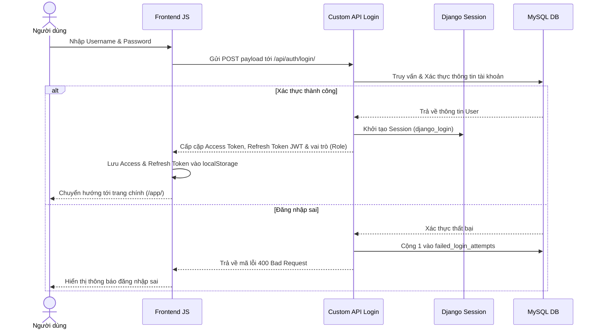
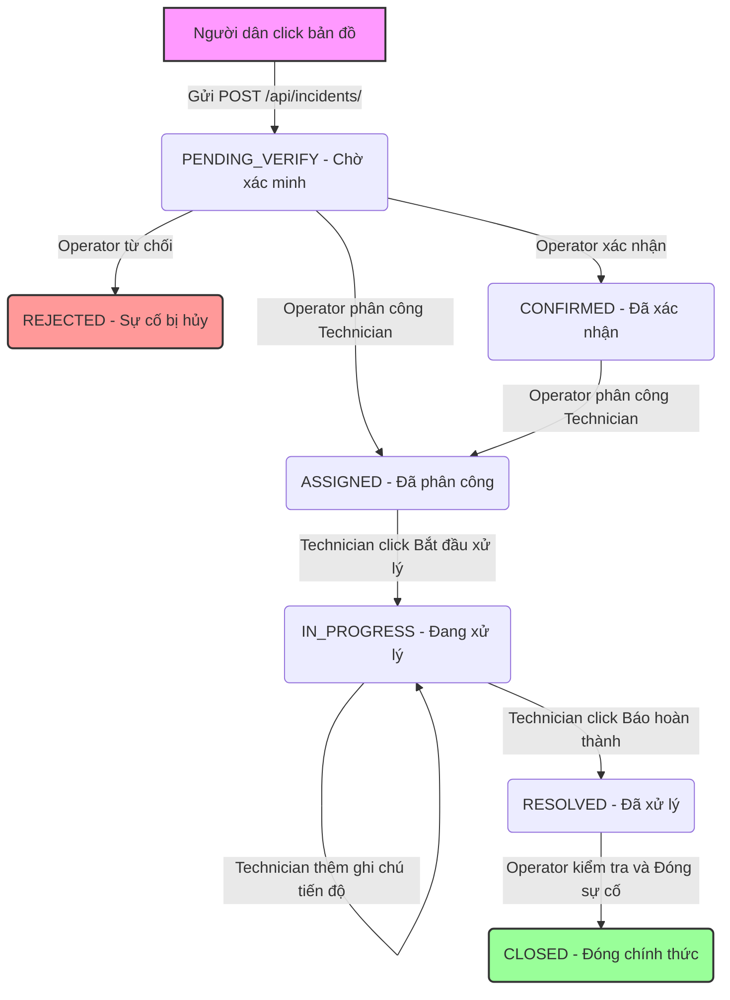

# 🗺️ Bản Đồ Chi Tiết Dự Án: Hệ Thống Quản Lý Hạ Tầng Điện – Nước Đô Thị

Tài liệu kiến trúc này cung cấp cái nhìn toàn diện về cấu trúc thư mục, kiến trúc phần mềm, cấu trúc dữ liệu chi tiết, các luồng nghiệp vụ cốt lõi và các cơ chế điều khiển tự động của dự án. 

---

## 1. Bản Đồ Thư Mục Dự Án (Project Directory Tree)

Dưới đây là cấu trúc tổ chức mã nguồn và các tệp tài nguyên thực tế của dự án:

```yaml
PM-Group-2/
│
├── core/                           # Thư mục cấu hình trung tâm của Django Project
│   ├── settings.py                 # Cấu hình dự án (Apps, Middleware, JWT, Throttling, MySQL & SQLite Database)
│   ├── urls.py                     # Cấu hình định tuyến URL toàn cục (Templates views & API endpoints)
│   ├── views.py                    # Health check API & Auth session views
│   ├── exception_handler.py        # Custom global API exception handler
│   └── wsgi.py / asgi.py           # Web Server Gateway Interface
│
├── accounts/                       # Django App: Quản lý Tài khoản & Phân quyền RBAC
│   ├── models.py                   # Custom User (ADMIN, OPERATOR, TECHNICIAN, CITIZEN) & AuditLog
│   ├── views.py                    # Viewsets xử lý Login (JWT+Session), Logout, Password Change, Profile
│   ├── serializers.py              # Serializers cho User, Login, AuditLog, Register
│   ├── urls.py                     # Định tuyến API tài khoản & phân quyền
│   ├── middleware.py               # AuditLogMiddleware tự động lưu nhật ký hoạt động POST/PUT/DELETE
│   ├── permissions.py              # Custom Permission classes (IsAdminRole, IsOperatorRole, v.v.)
│   └── signals.py                  # Khóa tài khoản sau 5 lần đăng nhập thất bại liên tiếp
│
├── assets/                         # Django App: Quản lý Thiết bị Hạ tầng & Mạng lưới Điện - Nước
│   ├── models.py                   # Lớp dữ liệu: Device, NetworkEdge, NetworkStatusHistory, ConsumptionLog
│   ├── views.py                    # API Viewsets, CSV Import/Export, Tiêu thụ nước/điện
│   ├── serializers.py              # Serializers cho Device & ConsumptionLog
│   ├── urls.py                     # Định tuyến API thiết bị và tuyến mạng
│   └── tests.py                    # Unit tests tự động cho hạ tầng và tiêu thụ
│
├── incidents/                      # Django App: Quản lý Sự cố & Điều phối Bảo trì
│   ├── models.py                   # Lớp dữ liệu: Incident, IncidentNote, Notification, IncidentHistory
│   ├── views.py                    # Viewsets xử lý Báo cáo, Phê duyệt, Phân công, Thống kê biểu đồ
│   ├── serializers.py              # Serializers cho Incident, IncidentNote, Notification
│   ├── urls.py                     # Định tuyến API sự cố & thông báo nội bộ
│   └── signals.py                  # Signals tự động bắn thông báo và đồng bộ trạng thái thiết bị/tuyến
│
├── templates/                      # Chứa các giao diện trang web (Django Templates)
│   ├── base.html                   # Giao diện khung chung (Bootstrap 5, Inter Font, Icons, SweetAlert2)
│   ├── login.html                  # Trang Đăng nhập hệ thống
│   ├── register.html               # Trang Đăng ký tài khoản dành riêng cho Người dân
│   ├── lookup.html                 # Giao diện Tra cứu chỉ số tiêu thụ công cộng (Glassmorphism)
│   ├── app.html                    # Bản đồ tương tác chính (Leaflet.js + OSM)
│   ├── monitoring.html             # Quản lý số liệu tiêu thụ điện – nước
│   ├── users.html                  # Giao diện quản lý tài khoản thành viên (chỉ dành cho ADMIN)
│   ├── incidents.html              # Quản lý danh sách sự cố và luồng điều phối
│   ├── report.html                 # Lọc báo cáo sự cố chi tiết nâng cao
│   ├── dashboard.html              # Bảng số liệu thống kê KPIs & Biểu đồ Chart.js
│   ├── notifications.html          # Hộp thư thông báo trong ứng dụng
│   └── analytics.html              # Phân tích dữ liệu chuyên sâu nâng cao
│
├── static/                         # Thư mục lưu trữ tài nguyên tĩnh (CSS, JS)
│   ├── css/
│   │   └── app.css                 # File thiết kế CSS giao diện và hiệu ứng Premium
│   └── js/                         # Logic điều khiển JavaScript thuần tương ứng với từng màn hình
│       ├── login.js                # Quản lý Đăng nhập, lưu JWT vào localStorage
│       ├── app.js                  # Khởi tạo bản đồ Leaflet, hiển thị trạm/tủ/van, vẽ đường dây/ống dẫn
│       ├── monitoring.js           # Xử lý API nhật ký tiêu thụ, vẽ biểu đồ tiêu thụ
│       ├── users.js                # Logic CRUD tài khoản thành viên
│       ├── incidents.js            # Logic báo cáo sự cố từ bản đồ, thêm ghi chú, cập nhật tiến độ
│       ├── report.js               # Bộ lọc báo cáo sự cố nâng cao & chuẩn bị xuất dữ liệu
│       ├── dashboard.js            # Nạp số liệu KPIs, vẽ biểu đồ hình tròn trạng thái và xu hướng 7 ngày
│       ├── notifications.js        # Logic đọc và đánh dấu đã đọc thông báo nội bộ
│       └── analytics.js            # Logic phân tích và hiển thị chuyên sâu
│
├── db.sqlite3                      # Cơ sở dữ liệu SQLite local (phục vụ chạy test hoặc chế độ chạy nhanh)
└── requirements.txt                # Danh sách thư viện Python phụ thuộc
```

---

## 2. Thiết Kế Cơ Sở Dữ Liệu Chi Tiết (Models Schemas)

### 🔐 2.1 Module `accounts` (Tài khoản & Nhật ký hoạt động)
* **`User` (Kế thừa từ `AbstractUser`)**:
  * `role`: Lựa chọn vai trò RBAC (`ADMIN` - Quản trị viên, `OPERATOR` - Vận hành viên, `TECHNICIAN` - Kỹ thuật viên, `CITIZEN` - Người dân).
  * `failed_login_attempts`: Bộ đếm số lần đăng nhập sai (tự động khóa ở lần thứ 5).
* **`AuditLog`**:
  * Tự động lưu nhật ký sửa đổi dữ liệu qua API.
  * Các trường: `user`, `action` (POST, PUT, DELETE, v.v.), `path` (endpoint API), `ip_address`, `timestamp`, `details` (dữ liệu thay đổi dạng JSON).

### 🔌 2.2 Module `assets` (Thiết bị hạ tầng & Tuyến nối)
* **`Device`**:
  * `code`: Mã thiết bị duy nhất.
  * `name`: Tên thiết bị.
  * `device_type`: Phân loại 11 loại thiết bị hạ tầng thuộc 2 nhóm chính:
    * *Hạ tầng Điện*: Trạm biến áp (`TRANSFORMER`), Tủ phân phối (`DISTRIBUTION_BOX`), Trụ điện (`ELECTRIC_POLE`), Điểm nối điện (`ELECTRIC_JUNCTION`), Công tơ điện (`ELECTRIC_METER`).
    * *Hạ tầng Nước*: Bể nước (`WATER_TANK`), Trạm bơm (`PUMP_STATION`), Van tổng (`MAIN_VALVE`), Van nhánh (`BRANCH_VALVE`), Điểm nối nước (`WATER_JUNCTION`), Đồng hồ nước (`WATER_METER`).
  * `latitude` / `longitude`: Tọa độ vị trí địa lý của thiết bị trên bản đồ.
  * `status`: Trạng thái mạng (`ACTIVE` - Hoạt động, `FAULT` - Lỗi trực tiếp, `MAINTENANCE` - Đang bảo trì, `INACTIVE` - Ngưng hoạt động).
  * `is_active`: Đồng bộ legacy (True ứng với `ACTIVE`, False ứng với các trạng thái khác).
* **`NetworkEdge`** (Tuyến truyền dẫn kết nối 2 thiết bị):
  * `code`: Tự động sinh `EDGE_fromDeviceID_toDeviceID`.
  * `network_type`: `ELECTRIC` hoặc `WATER`.
  * `from_device` / `to_device`: Khóa ngoại liên kết hai thiết bị đầu – cuối.
  * `status`: Trạng thái hoạt động (`ACTIVE`, `FAULT`, `MAINTENANCE`, `INACTIVE`).
  * Ràng buộc duy nhất: Một cặp thiết bị chỉ được phép nối tối đa 1 tuyến theo một hướng nhất định.
* **`ConsumptionLog`** (Nhật ký chỉ số tiêu thụ):
  * Lưu trữ sản lượng tiêu thụ định kỳ của công tơ điện hoặc đồng hồ nước.
  * Các trường: `device`, `date` (được chuẩn hóa về ngày 1 hàng tháng), `value`.

### ⚠️ 2.3 Module `incidents` (Sự cố & Điều phối)
* **`Incident`**:
  * `title` / `description`: Tiêu đề & mô tả chi tiết sự cố.
  * `incident_type`: `ELECTRIC` (Điện), `WATER` (Nước), `OTHER` (Khác).
  * `severity`: `LOW` (Thấp), `MEDIUM` (Trung bình), `HIGH` (Cao), `CRITICAL` (Khẩn cấp).
  * `status`: `PENDING_VERIFY` (Chờ xác minh), `CONFIRMED` (Xác nhận), `ASSIGNED` (Đã phân công), `IN_PROGRESS` (Đang xử lý), `RESOLVED` (Đã giải quyết), `CLOSED` (Đã đóng), `REJECTED` (Từ chối).
  * `target_type`: Xác định đích sự cố là Thiết bị (`DEVICE`), Tuyến mạng (`EDGE`) hoặc Chưa xác định (`UNKNOWN`).
  * Khóa ngoại: `device` (nếu có), `edge` (nếu có), `reported_by` (người dân báo cáo), `confirmed_by` (nhân viên xác nhận), `assigned_to` (kỹ thuật viên xử lý).
* **`IncidentNote`**: Lưu các ghi chú cập nhật tiến trình của Kỹ thuật viên hiện trường.
* **`Notification`**: Hộp thư thông báo trong ứng dụng cho người dùng khi trạng thái sự cố có sự thay đổi.
* **`IncidentHistory`**: Nhật ký tự động ghi lại từng bước chuyển dịch trạng thái của sự cố.

---

## 3. Cơ Chế Điều Khiển & Đồng Bộ Tự Động (Signals)

Hệ thống áp dụng mô hình hướng sự kiện (Event-driven) thông qua Django Signals để xử lý tự động các tác vụ nền:

1. **🔐 Bảo mật tài khoản (`accounts/signals.py`)**:
   * Lắng nghe sự kiện đăng nhập lỗi: Cộng dồn `failed_login_attempts`. Khi đạt `5` lần, tự động khóa tài khoản (`is_active = False`).
   * Lắng nghe sự kiện đăng nhập thành công: Reset bộ đếm đăng nhập lỗi về `0`.

2. **🔔 Quy trình thông báo & Đồng bộ trạng thái thiết bị (`incidents/signals.py`)**:
   * Lắng nghe sự kiện lưu `Incident`:
     * **Sự cố mới tạo**: Tự động tạo và gửi thông báo `NEW_INCIDENT` cho toàn bộ nhóm `ADMIN` và `OPERATOR`.
     * **Phân công nhiệm vụ**: Tạo và gửi thông báo `ASSIGNED` tới `TECHNICIAN` được giao xử lý.
     * **Thay đổi trạng thái khác**: Tạo và gửi thông báo cập nhật về cho `CITIZEN` đã báo cáo sự cố.
     * **Tự động thay đổi trạng thái hạ tầng**:
       * Khi một sự cố thuộc nhóm hoạt động lỗi (`PENDING_VERIFY`, `CONFIRMED`, `ASSIGNED`, `IN_PROGRESS`, `RESOLVED`) được kích hoạt: Thiết bị/tuyến liên kết tự động chuyển trạng thái thành `FAULT`.
       * Khi sự cố được đóng chính thức (`CLOSED`) hoặc bị từ chối (`REJECTED`): Hệ thống tự động kiểm tra xem thiết bị/tuyến đó còn sự cố hoạt động nào khác không. Nếu không còn, tự động phục hồi trạng thái thiết bị/tuyến về hoạt động bình thường (`ACTIVE`).

---

## 4. Sơ Đồ Luồng Nghiệp Vụ Cốt Lõi (Mermaid Flowcharts)

### 🔑 4.1 Luồng Đăng Nhập & Xác Thực (Authentication Flow)
Mô tả quá trình đăng nhập kết hợp song song JWT (dành cho các kết nối API) và Session (dành cho render Django Templates):



### ⚠️ 4.2 Luồng Vòng Đời Báo Cáo & Xử Lý Sự Cố (Incident Workflow)
Mô tả chi tiết cách thức các vai trò RBAC phối hợp khép kín trên hệ thống để xử lý sự cố hạ tầng đô thị:



---

## 5. Đặc Tả Thiết Lập Cơ Sở Dữ Liệu (Database Choice Configuration)

Dự án được cấu hình thông minh trong `core/settings.py` để lựa chọn động Database tùy theo ngữ cảnh thực thi:

```python
# Trích xuất logic cấu hình thực tế trong core/settings.py
if os.environ.get('USE_SQLITE') or os.environ.get('GITHUB_ACTIONS') or 'test' in sys.argv:
    DATABASES = {
        'default': {
            'ENGINE': 'django.db.backends.sqlite3',
            'NAME': BASE_DIR / 'db.sqlite3',
        }
    }
else:
    DATABASES = {
        'default': {
            'ENGINE': 'django.db.backends.mysql',
            'NAME': 'qlda_db',
            ...
        }
    }
```

* **Môi trường chạy thật/mặc định (Default)**: Kết nối tới **MySQL Database** để quản trị lâu dài lượng dữ liệu lớn và tối ưu hiệu năng truy vấn.
* **Môi trường kiểm thử tự động (Unit Tests)**: Tự động chuyển sang sử dụng tệp cơ sở dữ liệu **SQLite** (`db.sqlite3`) để đảm bảo các tiến trình tạo/xóa bảng phục vụ chạy test diễn ra độc lập, an toàn và nhanh gọn nhất.
